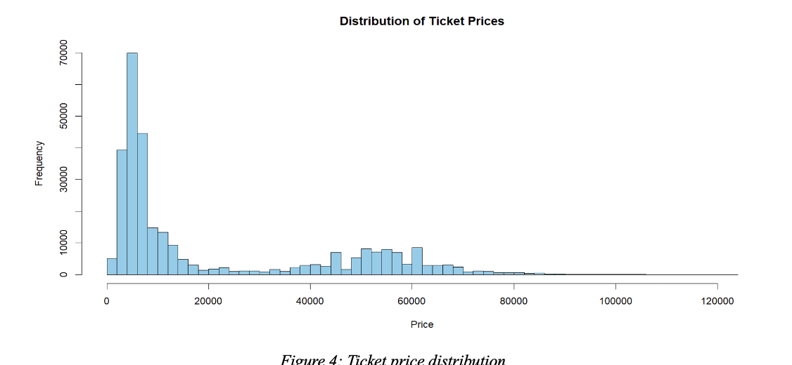
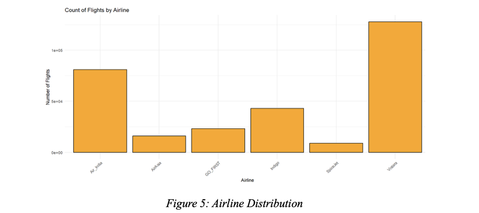
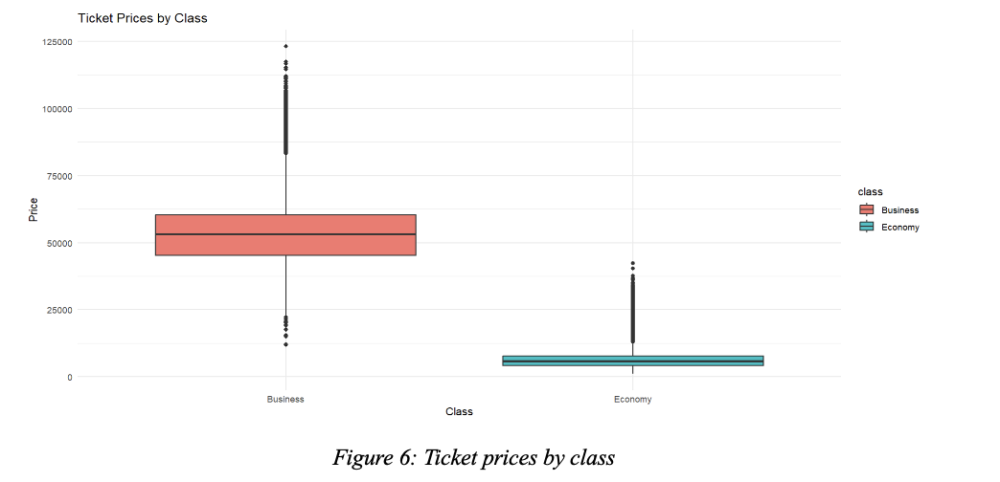
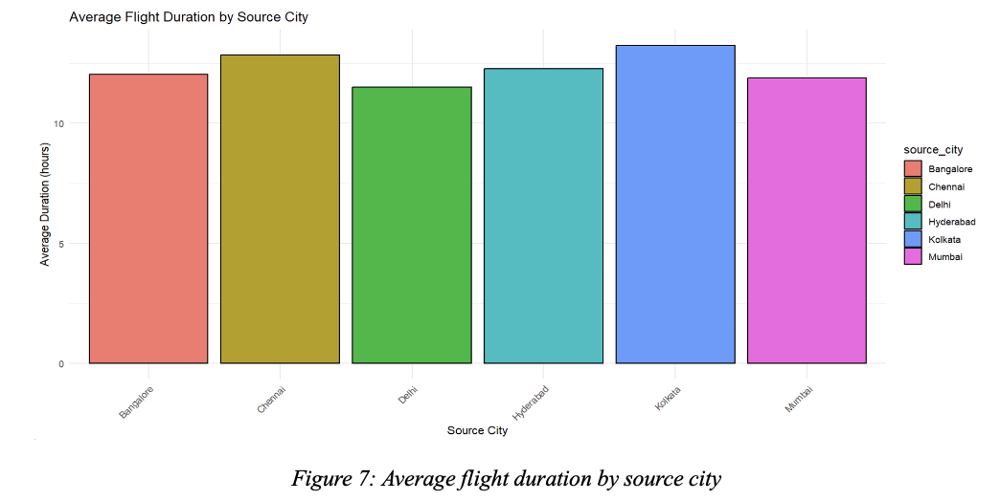
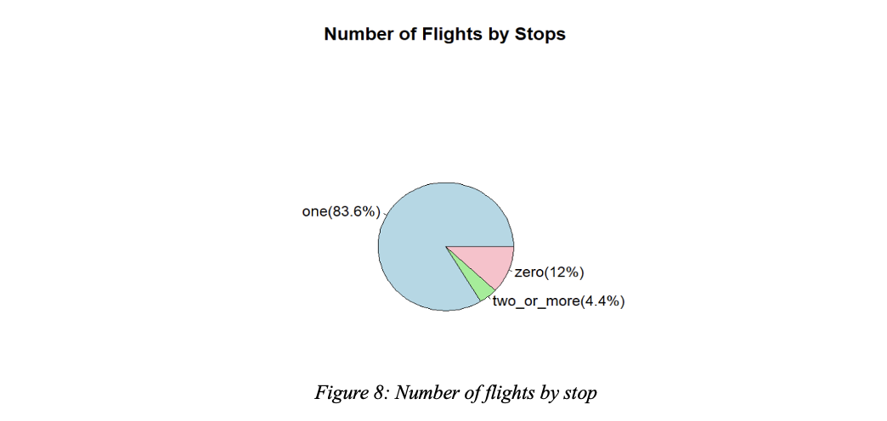
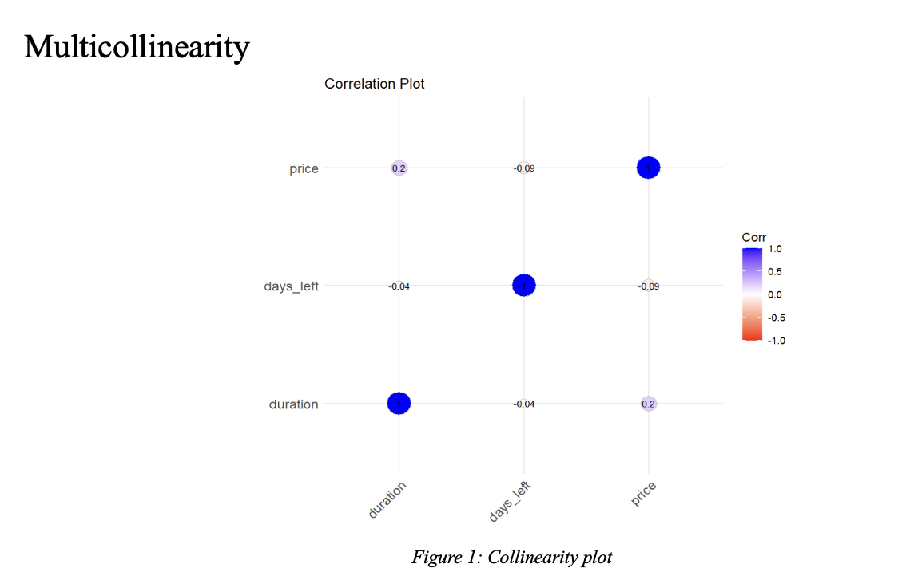
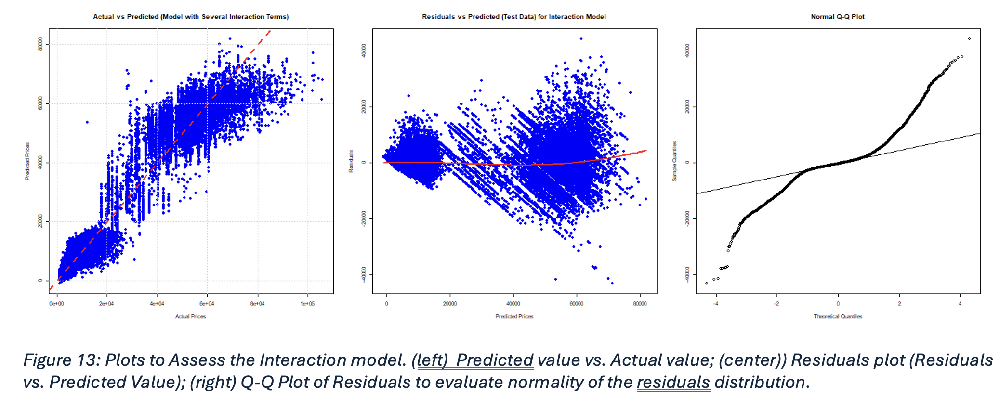
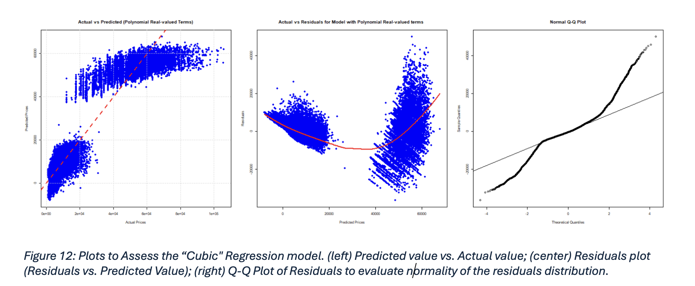
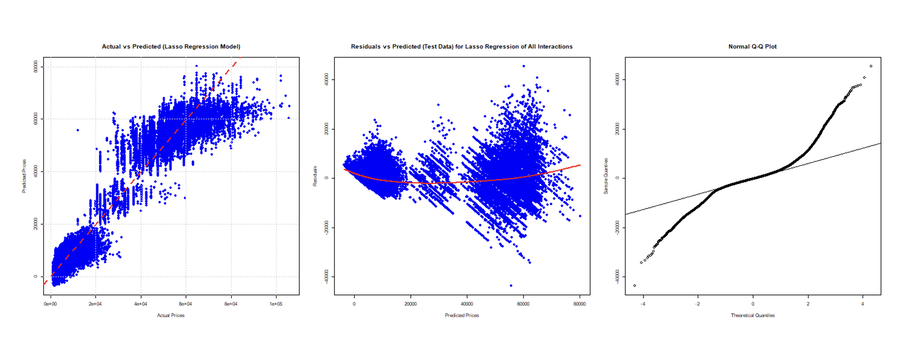

# ✈️ Flight Price Prediction (R)

  
**Predicting airline ticket prices using regression models, feature interactions, and regularization techniques in R.**  
This project delivers both **data-driven insights** into pricing factors and a **reproducible ML pipeline**.

---

## 📌 Overview
Airline ticket pricing is complex and influenced by multiple factors such as **airline, route, travel class, stops, flight duration, and booking window**.  

**Goals of this project:**
- Explore and visualize flight pricing data  
- Build and compare multiple regression models  
- Identify the most influential predictors of ticket price  
- Deliver reproducible analysis in R  

---

## 📊 Dataset
- **Source:** [Kaggle – Flight Price Prediction Dataset](https://www.kaggle.com/datasets/shubhambathwal/flight-price-prediction)  
- **File Required:** `data/raw/Clean_Dataset.csv`  
- **Size:** ~300,000 rows × 10 variables  

**Features**
- `airline` – Airline name  
- `source_city` / `destination_city` – Origin & destination  
- `class` – Economy / Business  
- `stops` – Number of stops  
- `duration` – Flight duration (hours)  
- `days_left` – Days before departure  
- `price` – Target variable (numeric)  

---

## 🔎 Exploratory Data Analysis (EDA)

Key findings:
- Ticket **prices are right-skewed** (most < ₹20,000)  
- **Business tickets** median ~₹50,000 vs **Economy ~₹7,000**  
- Majority of flights have **one stop (~83.6%)**  
- Non-linear effects from **duration** and **days_left**  

**Visuals**

  
  
  
  
  
  

---

## 🤖 Models Implemented
1. **Multiple Linear Regression** (baseline)  
2. **Subset Selection** (forward stepwise search)  
3. **Polynomial Regression** (quadratic & cubic terms)  
4. **Interaction Model** (city-pair & time effects + class-specific interactions)  
5. **Ridge Regression** (L2 regularization)  
6. **Lasso Regression** (L1 regularization & feature selection)  

Validation: **80/20 train–test split + 10-fold cross-validation**

---

## 📈 Results (Test Set)

| Model                  | Test MSE   | R²       | Adj. R²   |
|------------------------|------------|----------|-----------|
| Linear Regression      | ~43.7M     | ~0.915   | ~0.915    |
| Subset Selection       | ~43.7M     | ~0.915   | ~0.915    |
| Polynomial (Cubic)     | ~41.9M     | ~0.918   | ~0.918    |
| Ridge Regression       | ~30.6M     | ~0.941   | ~0.941    |
| **Lasso Regression**   | ~25.0M     | ~0.951   | ~0.951    |
| **Interaction Model**  | **23.9M**  | **0.953** | **0.953** |

✅ **Best Model:** Interaction Regression — captured route, time, and class effects most effectively.  
⚡ **Runner-up:** Lasso Regression — strong feature selection and generalization.  

---

## 📊 Sample Plots

### Interaction Model

### Polynomial Regression

### Lasso Regression

---

## 🛠️ Tech Stack
- **Language:** R  
- **Libraries:**  
  - `ggplot2`, `dplyr`, `ggcorrplot` → EDA & visualization  
  - `caTools`, `caret` → data splitting & validation  
  - `glmnet` → Ridge & Lasso regression  
  - `leaps` → Subset selection  
  - `Metrics` → evaluation (MSE, R², RMSE)  
  - `readr` → data import  

- **Reproducibility:**  
  - Quarto reports (`.qmd`)  
  - `Makefile` automation  
  - GitHub Actions (CI/CD)  

---

## 🚀 Future Improvements
- Feature engineering: holidays, weekday/weekend, seasonal effects  
- Advanced models: Random Forest, Gradient Boosting, XGBoost  
- Ensemble methods to boost accuracy  
- SHAP-based feature explainability  
- Deploy interactive dashboard (e.g., Shiny/Streamlit)  

---

## 📂 Project Structure
